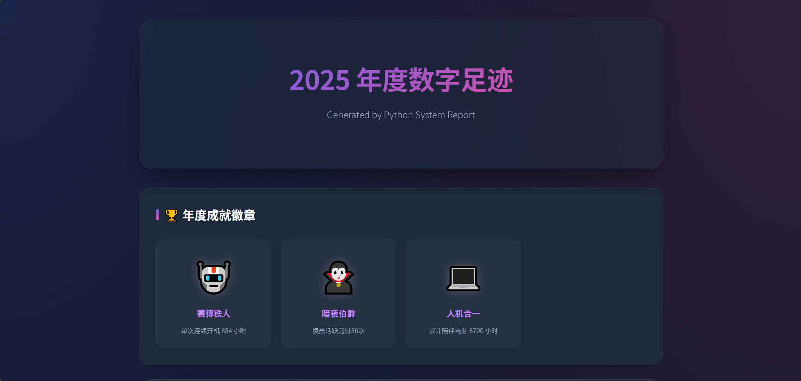

# 📟 Digital Life Report
**你的数字人生年度报告生成器**  

## 📖 简介 (Introduction)

Digital Life Report 是一个轻量级的 Python 工具集，旨在通过数据挖掘你的数字足迹。目前包含两个独立模块：
1.  **System Report**: 挖掘 Windows 系统日志，分析你的电脑使用习惯。
2.  **Lens Report**: (New!) 扫描照片 EXIF 数据，生成你的年度摄影风格画像。(目前只支持jpg格式)

所有数据处理均在**本地运行**，无需上传，安全隐私。

## 模块一：🖥️ [System Report (电脑使用报告)](./digital_life.py)

### ✨ 效果预览 (Preview)

### ✨ 主要功能 (Features)

* **🏆 成就系统**
  
    根据你的使用习惯解锁“赛博铁人”、“暗夜伯爵”、“蓝屏受害者”等成就。

* **📊 视觉化图表**

    24小时活跃度：你是晨型人还是夜猫子？

    摸鱼 vs 搬砖：工作日与周末的活跃对比。

    周常规律：一周中哪天你最离不开电脑。

* **💀 稳定性分析**

    统计蓝屏（BSOD）和异常断电次数，并在崩溃数据下附带“暖心”吐槽。

* **🤖 铁人记录**

    计算你单次最长连续开机时间。

## 模块二：📸 [Lens Report (摄影人生报告)](./camera.py)

通过解析本地照片文件夹的 EXIF 元数据，生成属于摄影师的年度总结。

### ✨ 主要功能
*   **🔭 焦段偏好分析**：你是“广角狂魔”还是“空气切割机”？(无数据默认14mm处理)。
*   **📷 器材党统计**：统计你使用了多少台不同的相机以及主力生产力工具。
*   **🥯 参数习惯**：分析你的光圈使用习惯（虚化大师 vs 小光圈战士）及 ISO/快门分布。
*   **🌃 作息捕捉**：根据拍摄时间判断你是“光影捕手”还是“夜之城行者”。

## ⚠️ 免责声明 (Disclaimer)

请在使用前仔细阅读以下条款：

* 软件性质：本软件仅供个人娱乐和统计使用。作者不对软件生成的统计数据的绝对准确性负责。

* 数据安全：本软件纯本地运行，不会将任何数据上传至互联网。生成的 HTML 报告包含您的作息规律信息，请勿随意分享给不可信的第三方。

* 杀毒软件误报：由于本软件在后台调用 PowerShell 读取系统日志，某些杀毒软件（如 360、Windows Defender）可能会将其识别为“可疑行为”或“Trojan/Malware”。这是读取系统底层的正常特征，属于误报。如果您不信任，请直接审查并运行 Python 源码。

* 禁止用于违法用途：使用时请遵守相关法律法规，严禁将本软件用于未经授权的员工监控、他人隐私窥探等违法用途。在公司或公共电脑上运行前，请务必遵守相关 IT 政策。

* 责任限制：本软件按“原样”提供，作者不承担因使用本软件导致的任何直接或间接损失（包括但不限于系统崩溃、数据丢失）。

## 🤝 致谢 (Acknowledgments)
* AI Co-pilot: 本项目的核心逻辑优化与 UI 设计由 Google Gemini 辅助完成。
